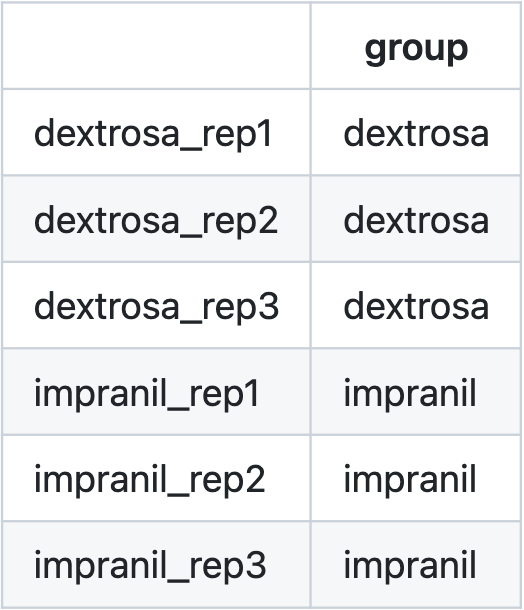

## Intructions

To use this Shiny app, you must upload two files: gene/features contingency matrix and metadata file. The format for the contingency matrix must be this:

Here is an example [table](https://raw.githubusercontent.com/LuiguiGallardo/shiny_diff_expr_lmgb/main/gene_counts_matrix_example.txt) (you can download it and test the application).

For the metadata file, we must have in the fist column the name of each sample and in the second column its group. This is an example [metadata table](https://raw.githubusercontent.com/LuiguiGallardo/shiny_diff_expr_lmgb/main/metadata_example.tsv):

After in the results section you can select the low-frequency reads, FoldChange, and p-value cutoffs, and in the 'Volcano plot' tab, you can obtain a graph with the overall differential expression between the groups and download it in SVG format. This is an example of the output:

